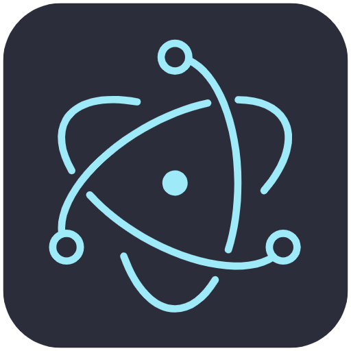

# PDF Translator

<p align="center">
  
</p>

PDF Translator is a powerful desktop application that transforms how you work with documents in different languages. Leveraging both traditional OCR (Optical Character Recognition) and advanced AI generative models, it provides seamless PDF translation capabilities for professionals, students, researchers, and anyone who works with multilingual content.

## 🚀 Features

- **Advanced OCR Technology**: Extract text accurately from PDFs, including those with complex layouts and images
- **Multiple Translation Options**: Translate content using traditional methods or AI-powered models
- **Document Structure Preservation**: Maintains formatting, layouts, and structure of original documents
- **Multi-Language Support**: Works with numerous languages for both source and target translations
- **Batch Processing**: Process multiple documents simultaneously
- **User-Friendly Interface**: Simple and intuitive design for all user levels
- **Cross-Platform**: Available for Windows, macOS, and Linux

## 🔧 How It Works

PDF Translator combines several technologies to deliver accurate translations:

1. **OCR Processing**: Scans and extracts text from PDFs, even from scanned documents or images
2. **AI-Powered Translation**: Uses advanced language models to provide context-aware translations
3. **Smart Formatting**: Preserves document layout and structure in the translated output
4. **Export Options**: Save translated documents in various formats (PDF, DOCX, TXT)

## 🌐 Supported Languages

PDF Translator supports translations between major world languages including but not limited to:

- English
- Spanish
- French
- German
- Chinese
- Japanese
- Russian
- Portuguese
- Italian
- Arabic
- And many more...

## 💻 Installation

Download the latest version for your operating system:

- Windows: `.exe` installer
- macOS: `.dmg` file
- Linux: `.AppImage`, `.deb`, or `.snap` packages

## 🔄 Updates

The application automatically checks for updates to ensure you always have access to the latest features and improvements.

## 🛠️ Development

PDF Translator is built with Electron, providing a robust cross-platform experience.

### Building from Source

```bash
# Clone the repository
git clone https://github.com/yourusername/pdf-translator.git

# Navigate to the project directory
cd pdf-translator

# Install dependencies
npm install

# Start the development server
npm run dev

# Build for production
npm run build
```

## 📄 License

This project is licensed under the MIT License - see the [LICENSE.md](LICENSE.md) file for details.

## 🤝 Contributing

Contributions are welcome! Please feel free to submit a Pull Request.

## 📞 Support

If you encounter any issues or have questions, please file an issue on the GitHub repository.

---

<p align="center">
  Made with ❤️ by the Juanipis, Cata
</p>
